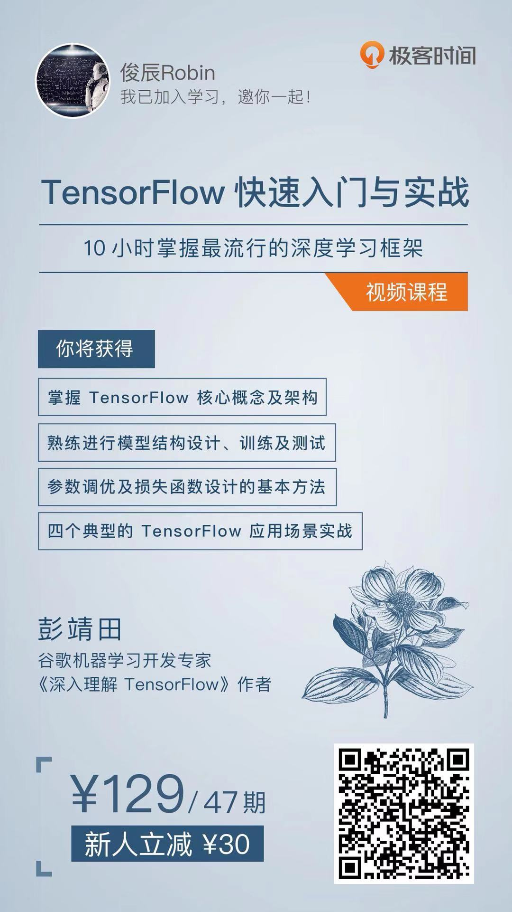

[](LICENSE)

# Tensorflow深度学习框架

1. 安装更新 `TensorFlow pip` 包，并验证

```shell
pip install --upgrade tensorflow
python -c "import tensorflow as tf; tf.enable_eager_execution(); print(tf.reduce_sum(tf.random_normal([1000, 1000]
```

TensorFlow快速入门与实战


## 🍭TensorFlow


|章节| 深度学习框架   | 笔记博客 | 案例代码 |
|:--| :------------- | :------- | :------- |
|01| **tensorflow入门** |          | [01-tensorFlow入门.ipynb](ch01-tensorflow入门/01-tensorFlow入门.ipynb)<br>[02-手写体数字识别.ipynb](ch01-tensorflow入门/02-手写体数字识别.ipynb) |
|02| **基本概念** |          | [01-张量初体验.ipynb](ch02-基本概念/01-张量初体验.ipynb)<br>[02-变量.ipynb](ch02-基本概念/02-变量.ipynb)<br/>[03-操作.ipynb](ch02-基本概念/03-操作.ipynb)<br/>[04-会话.ipynb](ch02-基本概念/04-会话.ipynb) |
|03| **房价预测** |          | [01-数据分析.ipynb](ch03-房价预测/01-数据分析.ipynb)<br/>[02-数据规范化.ipynb](ch03-房价预测/02-数据规范化.ipynb)<br/>[03-创建数据回归模型.ipynb](ch03-房价预测/03-创建数据回归模型.ipynb)<br/>[04-TensorBoard名字作用域.ipynb](ch03-房价预测/04-TensorBoard名字作用域.ipynb)<br/>[05-可视化损失函数.ipynb](ch03-房价预测/05-可视化损失函数.ipynb) |
|04| **手写体数字识别** |  | [01-加载MNIST数据集.ipynb](ch04-手写体识别/01-加载MNIST数据集.ipynb)<br>[02-MNIST-softmax.ipynb](ch04-手写体识别/02-MNIST-softmax.ipynb)<br/>[03-MNIST-CNN.ipynb](ch04-手写体识别/03-MNIST-CNN.ipynb) |
|05| **验证码识别** |  |  |
|06| **人脸识别** |  |  |


## 📚课件列表

[第一部分：TensorFlow初印象](slides/1-TensorFlow初印象.pdf)

[第二部分：TensorFlow初接触](slides/2-TensorFlow初接触.pdf)

[第三部分：TensorFlow基础概念解析](slides/3-TensorFlow基础概念解析.pdf)

[第四部分：实战TensorFlow房价预测](slides/4-实战TensorFlow房价预测.pdf)

[第五部分：实战TensorFlow手写体数字识别](slides/5-实战TensorFlow手写体数字识别.pdf)

[第六部分：实战TensorFlow验证码识别](slides/6-实战TensorFlow验证码识别.pdf)

[第七部分：实战TensorFlow人脸识别](slides/7-实战TensorFlow人脸识别.pdf)


##### The tensorflow note about the course on Youtube

[Ben老师tensorflow教程](https://www.youtube.com/watch?v=eAtGqz8ytOI&list=PLjSwXXbVlK6IHzhLOMpwHHLjYmINRstrk)

- [handwriting-tutorial](https://github.com/syao1026/handwriting-tutorial)
- [TensorflowNote](https://github.com/elevenkbc/TensorflowNote)

##### 斯坦福TensorFlow课程

[stanford-tensorflow-tutorials](https://github.com/chiphuyen/stanford-tensorflow-tutorials)

<br>

[syao1026/**DL-Lee**](https://github.com/syao1026)

this is the homework according to YouTube online courses of Prof. Lee from National Taiwan University

veeeery understandable and clear <https://www.youtube.com/playlist?list=PLJV_el3uVTsPy9oCRY30oBPNLCo89yu49>

i took some notes which i think it's interesting and new for me, and it's in English, not very detailed, but include important conclusions i got from the course, hope you could find something useful.

HW2 is about using education, nationality and other features to predict the incomes. I both tensorflow, and keras... the accuracy on validation data is about ~86% Cheers!

HW3 is doing the sentiment classification, the descripiton of HW, and data link can be found from<https://ntumlta.github.io/ML-Assignment3/index.html> I also upload the notes i took in lectures :

1. why we using CNN for image processing?
2. tips for DNN (how to improve the model by analysis the performance on training and validation data)
3. Why Deep? (why not wide) (because of memrory problem, the result is not good [bad, i would say (o(╥﹏╥)o)]), if you have bigger memory, you could deeper the network, which I think is quite simple using keras.

If you have the same problem like me, you could utilize the tips in "Tipps for DNN" to improve the result in HW2.

Cheers!


- 彭靖田[《TensorFlow快速入门与实战》](https://github.com/DjangoPeng/tensorflow-101)

