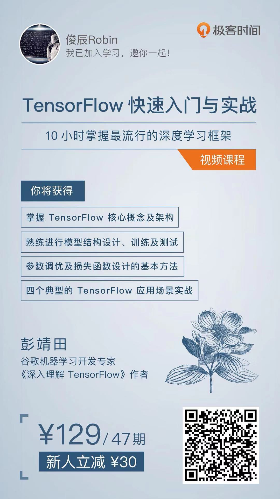

[](LICENSE)

# Tensorflow深度学习框架

1. 安装更新 `TensorFlow pip` 包，并验证

```shell
pip install --upgrade tensorflow
python -c "import tensorflow as tf; tf.enable_eager_execution(); print(tf.reduce_sum(tf.random_normal([1000, 1000]
```

TensorFlow快速入门与实战

## 📚课件列表

[第一部分：TensorFlow初印象](slides/1-TensorFlow初印象.pdf)

[第二部分：TensorFlow初接触](slides/2-TensorFlow初接触.pdf)

[第三部分：TensorFlow基础概念解析](slides/3-TensorFlow基础概念解析.pdf)

[第四部分：实战TensorFlow房价预测](slides/4-实战TensorFlow房价预测.pdf)

[第五部分：实战TensorFlow手写体数字识别](slides/5-实战TensorFlow手写体数字识别.pdf)

[第六部分：实战TensorFlow验证码识别](slides/6-实战TensorFlow验证码识别.pdf)

[第七部分：实战TensorFlow人脸识别](slides/7-实战TensorFlow人脸识别.pdf)


##### The tensorflow note about the course on Youtube
[Ben老师tensorflow教程](https://www.youtube.com/watch?v=eAtGqz8ytOI&list=PLjSwXXbVlK6IHzhLOMpwHHLjYmINRstrk)

- [handwriting-tutorial](https://github.com/syao1026/handwriting-tutorial)
- [TensorflowNote](https://github.com/elevenkbc/TensorflowNote)

##### 斯坦福TensorFlow课程
[stanford-tensorflow-tutorials](https://github.com/chiphuyen/stanford-tensorflow-tutorials)

<br>


- 彭靖田[《TensorFlow快速入门与实战》](https://github.com/DjangoPeng/tensorflow-101)

